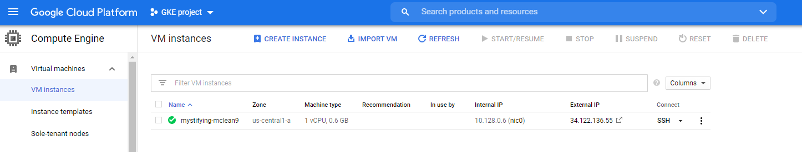
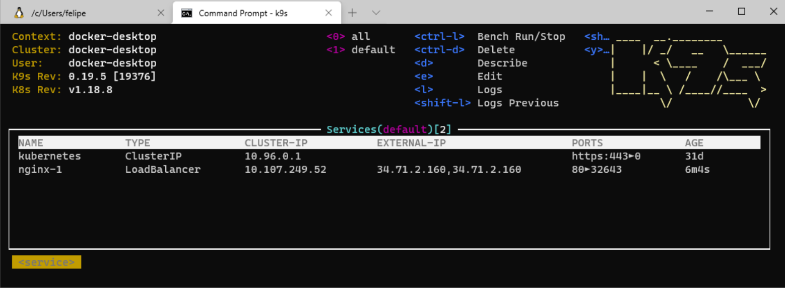

# inlets-demo-gcp

Expose nginx server running in Kubernetes to GCP using [inlets.dev](https://inlets.dev/)

## Getting started

Getting `arkade`:

```cli
curl -sSL https://dl.get-arkade.dev | sudo sh
```

On the Kubernetes host install `inlets-pro` and `inletsctl`

```cli
curl -sLSf https://inletsctl.inlets.dev | sudo sh

sudo inletsctl download --pro
```

```cli
./setup-gcp.sh
```

Provision a VM in Google Cloud Platform:

```cli
inletsctl create \
  --project-id $PROJECTID \
  --provider gce \
  --access-token-file key.json
```



Install the operator and specify the path for the GCP access token:

```cli
arkade install inlets-operator \
    --provider gce \
    --project-id $PROJECTID \
    --zone us-central1-a \
    --token-file key.json \
    --license $(cat ./inlets-pro-license.txt)
```

Deploy the nginx workload:

```cli
kubectl apply -f \
 https://raw.githubusercontent.com/inlets/inlets-operator/master/contrib/nginx-sample-deployment.yaml
```

Expose it with a `LoadBalancer` from Google Cloud Platform:

```cli
kubectl expose deployment nginx-1 --port=80 --type=LoadBalancer
```



## Clean up

```cli
inletsctl delete --provider gce \
    --id "<exit-node-name>|us-central1-a|<project-id>" \
    --access-token-file key.json
```

## References:

- https://blog.alexellis.io/get-private-kubectl-access-anywhere/
- https://blog.alexellis.io/ingress-for-your-local-kubernetes-cluster/
- https://docs.inlets.dev/#/tools/inlets-operator?id=create-exit-node-on-google-compute-engine
